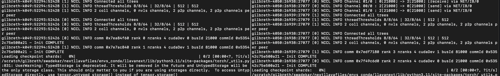

# Running LLaVA 1.0, 1.5, 1.6 on SLURM cluster
- This is a foundational Multimodal model which we can use as a baseline for doing multimodal tasks in our lab.

## Why LLaVA?

- Best performing open-source Multimodal model which can be fully trained with lab-resources (8 A-100 GPUs).
- It's modular architecture is best suitable for developing LWM (Large World Model).

## Instructions for running on SLURM cluster

## Install

1. Cluster login using terminal
```
ssh username@gilbreth.rcac.purdue.edu
```

2. Clone this repository in your and navigate to LLaVA folder
```bash
git clone https://github.com/haotian-liu/LLaVA.git
cd LLaVA
```

3. **Important** Load 'anaconda' module and the ***right version*** of cuda module. The cuda version above than 11.6 is required for installation of 'flash-attn' package. flash-attn package helps to accelerate the training time. 
```
module load anaconda/2020.11-py38
module load cuda/11.7.0
```

4. **Important** Before installing anything, create a conda environment. 
You can set 'env_name'. 
'/path/to/scratch/or/depot/' is the path where conda env will be created. 
You will be able to load conda env from this path.
Creating conda env in you local repo consumes a lot of space if you have multiple conda envs.
You only have 25 GB of space in you home folder on cluster.
Creating conda env on custom path helps to deal with the memory issue.
```
conda-env-mod create --prefix /path/to/scratch/or/depot/env_name --local-python
```
```
conda activate /path/to/scratch/or/depot/env_name
```

5. Install pip in your conda environment. When you install packages using pip, it sometimes installs packages system wide and later creates issues when upgrading some packages. So it is important to have a environment specific pip. So as best practise (based on the installations issues that I have faced), I install pip as the first step after creating new conda environment.
```
conda install anaconda::pip
```

6. Installing the cloned llava repo. If the flash-attn shows error, please check your cuda version that you have loaded. The installation error message will inform you clearly about the required cuda version. Please load the correct cuda version to avoid flash-attn related installation issues. If you face any other issues refer to the [readme of llava github repo](https://raw.githubusercontent.com/haotian-liu/LLaVA/main/README.md).
```
pip install -e .
pip install -e ".[train]"
pip install flash-attn --no-build-isolation
```

## Data for Finetuning: (Visual Instruction Tuning)

- **Download data in your scratch folder**.
- Since you only have 25 GB space in local folder, you will run into memory issues. Hence scratch is a good option.
- Other option is to download in 'depot/euge/data/username' folder, but this might result in slow training due to bandwidth issues. 'scratch' memory is faster than 'depot' memory in our SLURM cluster setup.
- Please download the annotation of the final mixture our instruction tuning data [llava_v1_5_mix665k.json](https://huggingface.co/datasets/liuhaotian/LLaVA-Instruct-150K/blob/main/llava_v1_5_mix665k.json), and download the images from constituting datasets:

    - COCO: [train2017](http://images.cocodataset.org/zips/train2017.zip)
    - GQA: [images](https://downloads.cs.stanford.edu/nlp/data/gqa/images.zip)
    - OCR-VQA: [download script](https://drive.google.com/drive/folders/1_GYPY5UkUy7HIcR0zq3ZCFgeZN7BAfm_?usp=sharing), **we save all files as `.jpg`**
    - TextVQA: [train_val_images](https://dl.fbaipublicfiles.com/textvqa/images/train_val_images.zip)
    - VisualGenome: [part1](https://cs.stanford.edu/people/rak248/VG_100K_2/images.zip), [part2](https://cs.stanford.edu/people/rak248/VG_100K_2/images2.zip)

- After downloading all of them, organize the data as follows in `./playground/data`,

```
├── coco
│   └── train2017
├── gqa
│   └── images
├── ocr_vqa
│   └── images
├── textvqa
│   └── train_images
└── vg
    ├── VG_100K
    └── VG_100K_2
```

- Images downloaded in ocr_vqa will have some images with .gif or .png extensions. These needs to be converted to .jpg. All the images should in the format of jpg. You can directly edit/change there names.

## Download pretrained models in your scratch folder

- Download the following pretrained models from huggingface in scratch or depot folder
- **[Important]** If these modes are not downloaded by us, then the code will try to download these in your local directory and you will run into memory issues. So it is important to download and store them in scratch or depot folder.
- [Pretrained LLaVA](https://huggingface.co/liuhaotian/llava-v1.5-7b)
- [Pretrained Projector](https://huggingface.co/liuhaotian/llava-v1.5-mlp2x-336px-pretrain-vicuna-7b-v1.5)
- [Pretrained CLIP](https://huggingface.co/openai/clip-vit-large-patch14-336)
- Node the path where it is saved. Add these paths in ***slurm_finetune_lora_mn_1.sh*** and ***slurm_finetune_lora_mn_2.sh*** files.
- Add CLIP path to the '--vision tower' argument in these files.
- Add Projector path to the '--pretrain_mm_mlp_adapter' argument in these files.
- Add llava path to the '--model_name_or_path' argument in these files.

## SLURM steps for Finetuning: (Visual Instruction Tuning)

### Summary steps:
- Initiate an interactive session with 2 nodes with 2 GPUs each
- Edit slurm_finetune_lora_mn_1.sh script with the ip address of Node 1.
- Run slurm_finetune_lora_mn_1.sh on Node 1
- Edit slurm_finetune_lora_mn_2.sh script with ip address and PORT number obtained after running script 1.
- Run slurm_finetune_lora_mn_2.sh on Node 2

### Step 1: Initiate sinteractive session using your terminal
```
sinteractive -N 2 --ntasks-per-node 2 --gres=gpu:2 -A euge-k -t 48:00:00 --cpus-per-task 32 --exclusive
```

- This will instantiate a session with two nodes. Each node will have 2 A-100 GPUs. So we are intending to use total 4 A-100 GPUs.
- '-N' determines the node
- '--ntasks-per-node' determines GPUs per node 
- Currently we only have these two configurations on the cluster '--gres=gpu:1' and '--gres=gpu:2'. Since we want to use 2 GPUs per node, we use the '--gres=gpu:2'. The '2' here has to match '2' in '--ntasks-per-node'.
- '-A' is for account information. 'euge-k' is our account name on cluster.
- '-t' is for session max time that we want to have the resources for.
- Once the resources are allocated, you will have access to two nodes.
- To get node details, run the below command. This will give you the JOBID that you are running. 
```
squeue --me
```
- Use the id_number from the above command and use it with below command to know node details.
```
jobinfo JOBID
```
- **The printed information after running the above command will give you hostname of the two nodes. This is important to note.**
- Example: gilbreth-k039, gilbreth-k040
- After the job has been successfully allocated to you/user, you/user will already be in one of the nodes. You can run 'hostname' command to know if you are in k039 or k-040 for example. You can ssh into gilbreth and then ssh into the other node using the other hostname 'ssh gilbreth-k040 or gilbreth-k039'
- **For this below instructions, let say after you are allocated the resources, and you are in gilbreth-k039.**
- You can note the ip address by running the below command in terminal
```
ip a
```
- Run the above command for your current node and note the ip address. You will be using this in the slurm script.

## Step 2: 

- I have added following files in folder: /depot/euge/data/swadekar/multinode_llava_scripts
- Copy File 1, File 2 and File 3 in scripts/v1_5 folder of the cloned llava repo. 
- File 1: ***slurm_finetune_lora_mn_1.sh***
- File 2: ***slurm_finetune_lora_mn_2.sh***
- File 3: ***find_free_port.py***
- Copy File 4 in ocr_vqa folder. This can be used to change the image extensions of .gif and .png files to .jpg
- File 4: ***change_img_extensions.py***


### Step 3: On you Node 1: (Ex: gilbreth-k039)

- Your current terminal, after getting the resouces allocate to you, will be the Node 1.
- Run 'ip a' and note the ip address
- Edit the file ***slurm_finetune_lora_mn_1.sh*** to add this ip address in the line,
```
--rdzv_endpoint="172.18.36.146:${MASTER_PORT}"
```
- Edit '172.18.36.146' with the ip address of Node 1.
- A script for automaically finding free open port is included here.
- The open port will be added as MASTER_PORT automatically.
- Go to the llava home folder and run the ***slurm_finetune_lora_mn_1.sh*** script on Node 1
```
bash scripts/v1_5/slurm_finetune_lora_mn_1.sh
```
- **When this code is executed, this will print the MASTER_PORT number. Note it. This will be used in step 3.**
- Now, the after running the above command, some logs will be printed and the code execution halts.
- This code is now waiting for Node 2 execution. As soon as we run the other script on Node 2, you will see further execution of code in this terminal.

### Step 4: On your Node 2: (Ex: gilbreth-k040)

- **Open a new terminal**
- ssh into Node 2. One way is to run the below command, for example:
```
ssh username@gilbreth.rcac.purdue.edu
ssh gilbreth-k040
```
- Edit the file ***slurm_finetune_lora_mn_2.sh***. Add ip address of Node 1 and MASTER_PORT that you had noted in previous step in the following line.
```
--rdzv_endpoint="172.18.36.146:${MASTER_PORT}"
```
- Here '172.18.36.146' will be replaced by the Node 1 ip address.
- The MASTER_PORT will be replaced by the port number you noted in the previous step.
- Go to the llava home folder and run the ***slurm_finetune_lora_mn_2.sh*** script on Node 1
```
bash scripts/v1_5/slurm_finetune_lora_mn_2.sh
```
- You will see logs getting printed, and now both the Node 1 and Node 2 terminals will start the execution of the trianing code. You will see logs getting printed on both the terminals.
- To verify that each process is unique on each GPU, you can try to find the following logs in your teminals.
- **You should see unique rank for each GPU**




### Step 5. Visualize training on [WANDB](https://wandb.ai/site)

- After successfull initiation of the code on both nodes, the Node 1 terminal will print a wandb link where you can visualize your trianing logs.
- You can copy the link and open it any browser to visualize it. 
- The trianing logs include: Loss vs steps, GPU memory consumption, GPU compute utilization and etc.
- The link will ask for you to log into you wand account. If you don't have [wandb](https://wandb.ai/site) account, please create one before running this code.


